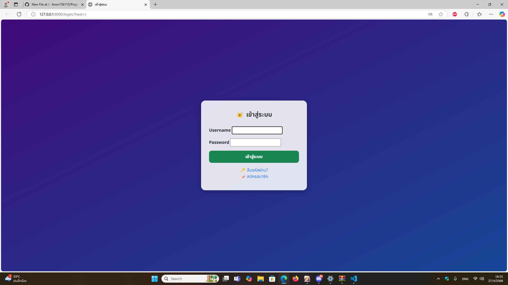
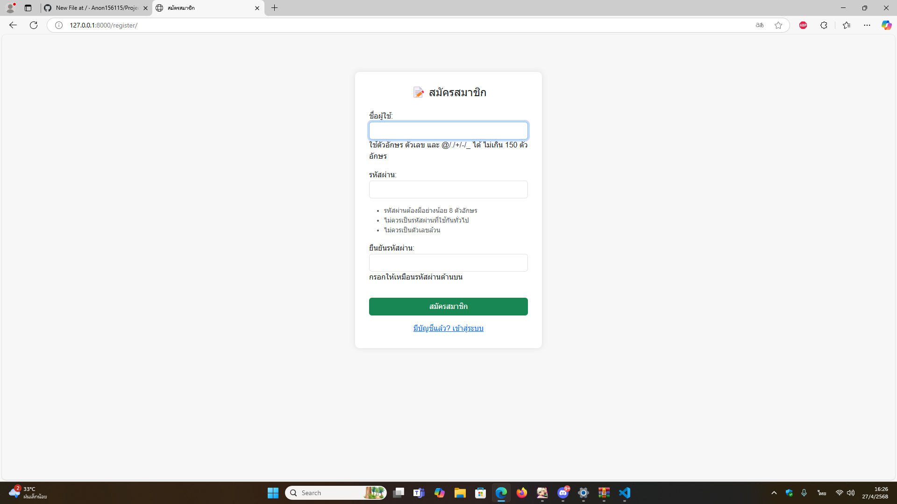
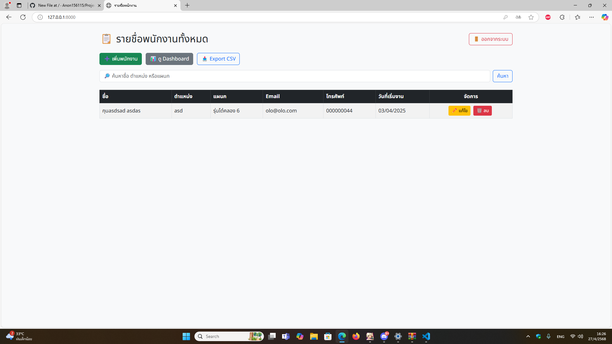
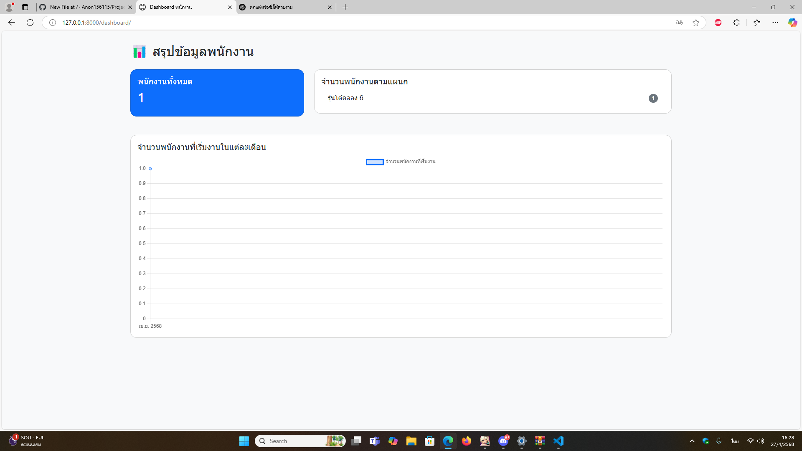
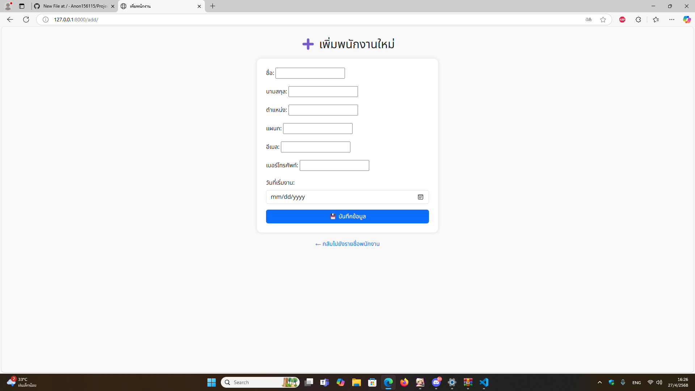

# โปรเจควิชา ICT 12367 หัวข้อ ระบบจัดการรายชื่อพนักงาน

โปรเจกต์นี้เป็นระบบจัดการพนักงานเบื้องต้น พัฒนาด้วย **Django 4.2** และ **Bootstrap 5**  
สามารถเพิ่มพนักงาน, ดูรายชื่อพนักงาน และบันทึกข้อมูลลงฐานข้อมูลได้จริง

---

## 🚀 ฟีเจอร์ที่มีในระบบ

- ➕ เพิ่มพนักงานใหม่ (Add Employee)
- 📋 แสดงรายชื่อพนักงานทั้งหมด (List Employee)
- 📅 บันทึกวันเริ่มงานของพนักงาน
- 💰 บันทึกเงินเดือนพนักงาน
- ✅ เลือกสถานะการทำงาน (ทำงาน / ลาออก)
- 🛠 ใช้ Bootstrap5 UI เรียบง่ายสวยงาม
- 💾 ข้อมูลถูกบันทึกลงฐานข้อมูล (SQLite)

---

## 🏗 เทคโนโลยีที่ใช้

- Python 3.10+
- Django 4.2
- Bootstrap 5
- HTML5 + CSS3
- SQLite Database

---

⚙️ ขั้นตอนการใช้งานระบบ
🔑 หน้า Login

กรอก Username / Password ที่สมัครไว้

ถ้ากรอกผิด มีแจ้งเตือนข้อผิดพลาด

ถ้ากรอกถูก → เข้า Dashboard

📝 หน้า สมัครสมาชิก (Register)

กรอก Username, Email, Password และ Confirm Password

กดปุ่ม สมัครสมาชิก เพื่อสร้างบัญชี

เมื่อสำเร็จ จะถูกพาไปยังหน้า Login เพื่อเข้าสู่ระบบ

🧾 หน้า รายชื่อพนักงานทั้งหมด (List Employee)
คำอธิบายสำหรับหน้านี้:

แสดง ตารางรายชื่อพนักงานทั้งหมด ที่มีในระบบ

ตารางประกอบด้วยคอลัมน์: ชื่อ, ตำแหน่ง, แผนก, อีเมล, เบอร์โทรศัพท์, วันที่เริ่มงาน, การจัดการ

มี ฟังก์ชันการค้นหา พนักงานจากช่องค้นหาด้านบน (ตามชื่อ/ตำแหน่ง/แผนก)

แต่ละแถวของข้อมูล มีปุ่ม แก้ไข (Edit) และ ลบ (Delete)

มีปุ่ม เพิ่มพนักงาน เพื่อเพิ่มข้อมูลใหม่

มีปุ่ม Export CSV เพื่อดาวน์โหลดข้อมูลพนักงานเป็นไฟล์ .csv

มีปุ่ม Dashboard เพื่อดูภาพรวมกราฟสรุปข้อมูล

🏠 หน้า Dashboard

แสดงข้อมูลสรุปจำนวนพนักงานแต่ละแผนก

กดปุ่ม เพิ่มพนักงาน เพื่อไปหน้าเพิ่มข้อมูล

➕ หน้าเพิ่มพนักงาน (Add Employee)

กรอกชื่อ นามสกุล รหัสพนักงาน เบอร์โทร อีเมล เงินเดือน วันที่เริ่มงาน

กด บันทึกข้อมูล เพื่อเพิ่มข้อมูลใหม่

กดปุ่ม ออกจากระบบ บน Navbar เพื่อ Logout กลับมาที่หน้า Login
