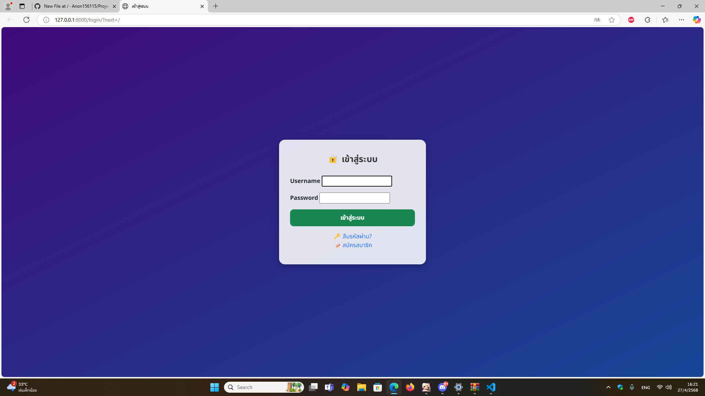
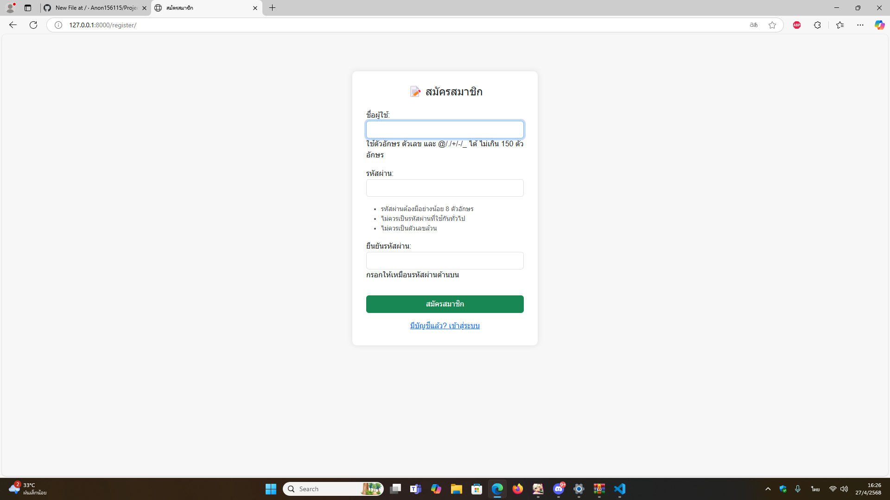
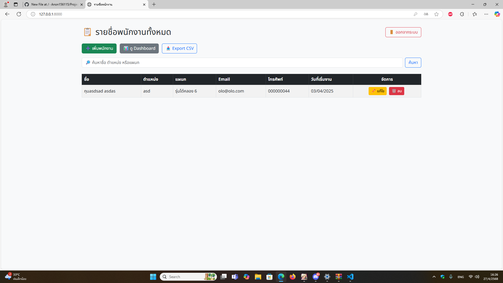
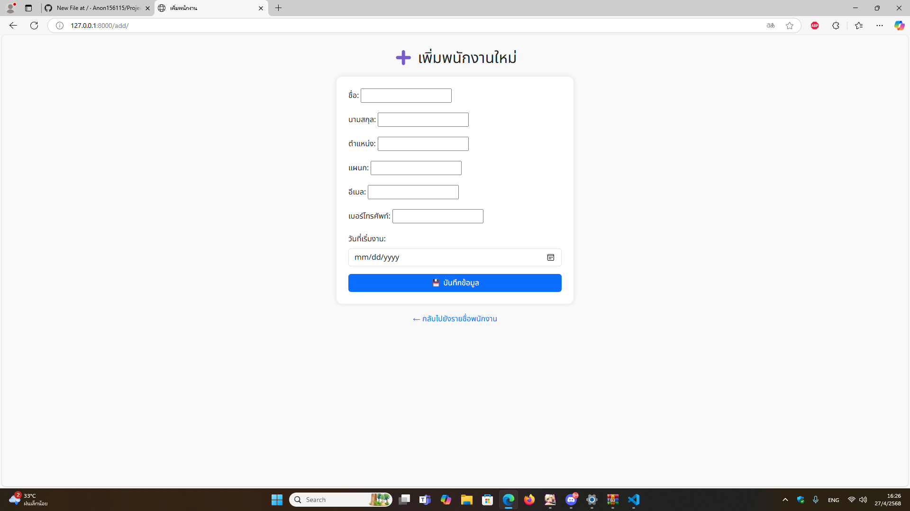
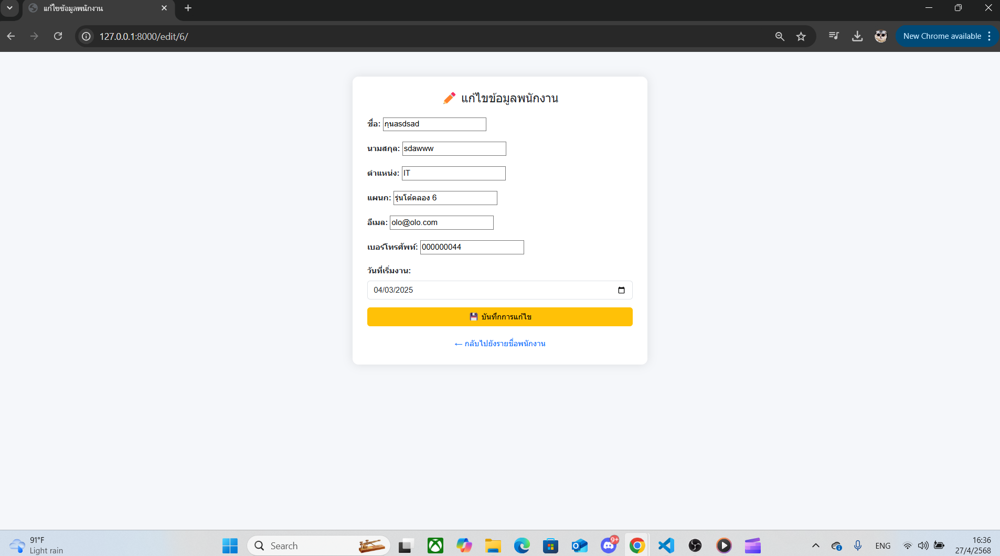
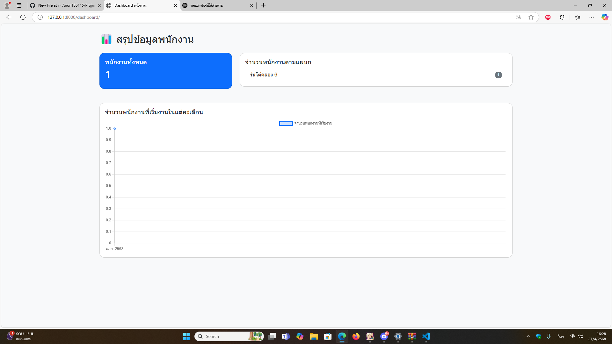

📚 ระบบจัดการรายชื่อพนักงาน
โปรเจควิชา ICT 12367

📖 รายละเอียดโปรเจค
โปรเจคนี้พัฒนาขึ้นโดยใช้ Python และ Django Framework เพื่อสร้างระบบจัดการข้อมูลพนักงานออนไลน์ รองรับการสมัครสมาชิก ล็อกอิน ล็อกเอาต์ และการจัดการข้อมูลพนักงาน (เพิ่ม, แก้ไข, ลบ) อย่างครบวงจร

🎯 ฟีเจอร์หลัก (Features)
ระบบสมัครสมาชิก (Register)

ระบบล็อกอิน (Login)

ระบบล็อกเอาต์ (Logout)

จัดการข้อมูลพนักงาน:

เพิ่มข้อมูลพนักงาน

แก้ไขข้อมูลพนักงาน

ลบข้อมูลพนักงาน

แสดงรายชื่อพนักงานทั้งหมดในรูปแบบตาราง

ระบบแสดงสถานะการทำงาน และเลือกแผนกพนักงานด้วยฟอร์ม

⚙ วิธีติดตั้งและใช้งาน (Installation & Usage)
1. เตรียมสภาพแวดล้อม
ติดตั้ง Python 3.8 ขึ้นไป

ติดตั้ง Django 4.0.4 ขึ้นไป

2. ติดตั้ง dependencies
bash
คัดลอก
แก้ไข
pip install -r requirements.txt
3. ตั้งค่าฐานข้อมูล
bash
คัดลอก
แก้ไข
python manage.py makemigrations
python manage.py migrate
4. รันเซิร์ฟเวอร์
bash
คัดลอก
แก้ไข
python manage.py runserver
เข้าใช้งานผ่านเบราว์เซอร์ที่:

plaintext
คัดลอก
แก้ไข
http://127.0.0.1:8000/

วิธีการใช้งานหน้า login

🛠 วิธีการใช้งานทีละขั้นตอน

ขั้นตอน	รายละเอียด
1	เข้าหน้าเว็บไซต์ → ระบบจะพาไปหน้า Login อัตโนมัติ (ถ้ายังไม่ล็อกอิน)
2	กรอก Username ที่สมัครไว้
3	กรอก Password ที่ตรงกับ Username
4	กดปุ่ม Login
5	หากข้อมูลถูกต้อง → ระบบพาไปหน้า "รายชื่อพนักงานทั้งหมด" ทันที
6	หากข้อมูลผิด → ระบบแสดงข้อความแจ้งเตือนให้ตรวจสอบใหม่

วิธีการใช้งานหน้าสมัครสมาขิก

🛠 วิธีการใช้งานทีละขั้นตอน

ขั้นตอน	รายละเอียด
1	เปิดหน้าเว็บไซต์ หรือระบบ แล้วคลิกปุ่ม "สมัครสมาชิก"
2	กรอก Username ที่ต้องการใช้
3	กรอก Email ที่ถูกต้อง (ต้องไม่ซ้ำกับผู้ใช้คนอื่น)
4	กรอก Password ที่ต้องการ
5	กรอก Confirm Password ให้ตรงกับ Password
6	ตรวจสอบข้อมูลทั้งหมดให้ถูกต้อง
7	กดปุ่ม "สมัครสมาชิก" เพื่อส่งข้อมูลลงทะเบียน
8	ระบบจะบันทึกข้อมูล และนำคุณไปยังหน้า Login เพื่อเข้าสู่ระบบด้วยบัญชีใหม่ที่สมัครไว้

วิธีการใช้งานหน้าหลักของเว็บไซต์

🛠 วิธีการใช้งานหน้านี้

ฟังก์ชัน	วิธีการใช้งาน
เพิ่มพนักงาน	คลิก เพิ่มพนักงาน → กรอกข้อมูลในฟอร์ม → กดบันทึก
ค้นหาพนักงาน	พิมพ์ชื่อ/ตำแหน่ง/แผนกในช่องค้นหา → กดปุ่ม ค้นหา
แก้ไขข้อมูล	คลิกปุ่ม 🛠 แก้ไข ที่แถวพนักงานที่ต้องการ → แก้ไขข้อมูล → บันทึก
ลบพนักงาน	คลิกปุ่ม 🗑 ลบ ที่แถวพนักงานที่ต้องการ → ยืนยันการลบ
ส่งออกข้อมูล CSV	คลิก Export CSV → ไฟล์จะถูกดาวน์โหลดทันที
ออกจากระบบ	คลิก ออกจากระบบ สีแดง เพื่อ Logout และกลับไปหน้า Login

วิธีการใช้งานระบบหน้าเพิ่มพนักงาน

🛠 วิธีการใช้งานทีละขั้นตอน

ขั้นตอน	รายละเอียด
1	คลิกปุ่ม ➕ เพิ่มพนักงาน บนหน้ารายชื่อพนักงาน
2	ระบบจะพามาหน้าแบบฟอร์ม "เพิ่มพนักงาน"
3	กรอกข้อมูลของพนักงานใหม่ให้ครบถ้วนตามช่องที่กำหนด
4	ตรวจสอบข้อมูลอีกครั้งเพื่อความถูกต้อง
5	กดปุ่ม "บันทึกข้อมูลพนักงาน" เพื่อเพิ่มข้อมูลใหม่เข้าสู่ระบบ
6	ระบบจะบันทึกข้อมูล แล้วนำคุณกลับไปยัง "หน้ารายชื่อพนักงาน" พร้อมแสดงรายชื่อที่เพิ่งเพิ่ม

วิธีการใช้งานหน้าแก้ไขข้อมูล

🛠 วิธีการใช้งานทีละขั้นตอน

ขั้นตอน	รายละเอียด
1	เลือกพนักงานที่ต้องการแก้ไขจากหน้า "รายชื่อพนักงานทั้งหมด" → คลิกปุ่ม แก้ไข 🛠️
2	ระบบจะพาเข้ามาหน้า "แก้ไขข้อมูลพนักงาน"
3	แก้ไขข้อมูลที่ต้องการ เช่น ชื่อ, ตำแหน่ง, เบอร์โทร ฯลฯ
4	กดปุ่ม บันทึกการแก้ไข 💾 เพื่ออัปเดตข้อมูล
5	ระบบจะบันทึกข้อมูล และ Redirect กลับไปยัง "หน้ารายชื่อพนักงาน" พร้อมแสดงข้อมูลที่แก้ไขแล้ว

วิธีการใช้งานหน้า Dashboard

🛠 วิธีการใช้งานทีละขั้นตอน

ขั้นตอน	รายละเอียด
1	หลังจาก Login สำเร็จ หรือคลิกปุ่ม "Dashboard" บนหน้ารายชื่อพนักงาน
2	เข้าสู่หน้า Dashboard เพื่อดูภาพรวมข้อมูลทั้งหมด
3	อ่านข้อมูลที่แสดง เช่น จำนวนพนักงาน, แผนก, ตำแหน่งต่าง ๆ
4	กดปุ่ม Export เพื่อดาวน์โหลดรายงานออกมาเป็นไฟล์ CSV
